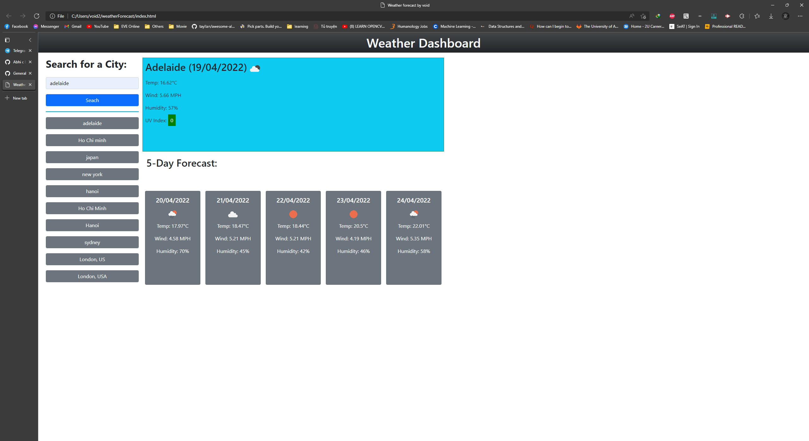

# <Weather-Forecast>

## Description
This project is created for user to know the weather forecast. Which can be used for many application such as farming.

## Usage
Enter the city name into the search box and click search or choose 1 city from search history button.
Below is an example of the application:

## Credits
Chi Hieu Nguyen

## Badges

## Features

1. When you search a city, the data for that city will be displayed along with its forecast.
2. When you search a city, that city will be saved to local storage and display as a button for quick access, search History stores up to 10 city.
3. When you click a button in search History, data will show that city.
4. When showing data for UV of a city, it will be:
    - green: UV <= 2
    - yellow: 3 <= UV <= 5
    - orange: 6 <= UV <= 7
    - red: 8 <= UV <= 10
    - violet: UV >= 11+