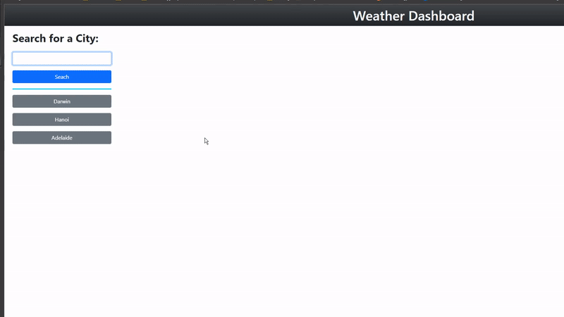

# <Weather-Forecast>

## Weather forecast

## Description
This project is created for user to know the weather forecast. Which can be used for many application such as farming.

## Usage
Enter the city name into the search box and click search or choose 1 city from search history button.
Below is an example of the application:

## Badges

## Features

1. When you search a city, the data for that city will be displayed along with its forecast.
2. When you search a city, that city will be saved to local storage and display as a button for quick access, search History stores up to 10 city.
3. When you click a button in search History, data will show that city.
4. When showing data for UV of a city, it will be:
    - green: UV <= 2
    - yellow: 3 <= UV <= 5
    - orange: 6 <= UV <= 7
    - red: 8 <= UV <= 10
    - violet: UV >= 11+

## License
	MIT License

	Copyright (c) 2022 Chi Hieu Nguyen

	Permission is hereby granted, free of charge, to any person obtaining a copy
	of this software and associated documentation files (the "Software"), to deal
	in the Software without restriction, including without limitation the rights
	to use, copy, modify, merge, publish, distribute, sublicense, and/or sell
	copies of the Software, and to permit persons to whom the Software is
	furnished to do so, subject to the following conditions:

	The above copyright notice and this permission notice shall be included in all
	copies or substantial portions of the Software.

	THE SOFTWARE IS PROVIDED "AS IS", WITHOUT WARRANTY OF ANY KIND, EXPRESS OR
	IMPLIED, INCLUDING BUT NOT LIMITED TO THE WARRANTIES OF MERCHANTABILITY,
	FITNESS FOR A PARTICULAR PURPOSE AND NONINFRINGEMENT. IN NO EVENT SHALL THE
	AUTHORS OR COPYRIGHT HOLDERS BE LIABLE FOR ANY CLAIM, DAMAGES OR OTHER
	LIABILITY, WHETHER IN AN ACTION OF CONTRACT, TORT OR OTHERWISE, ARISING FROM,
	OUT OF OR IN CONNECTION WITH THE SOFTWARE OR THE USE OR OTHER DEALINGS IN THE
	SOFTWARE.

## Contact Information
void2412@gmail.com

## Credit
Chi Hieu Nguyen